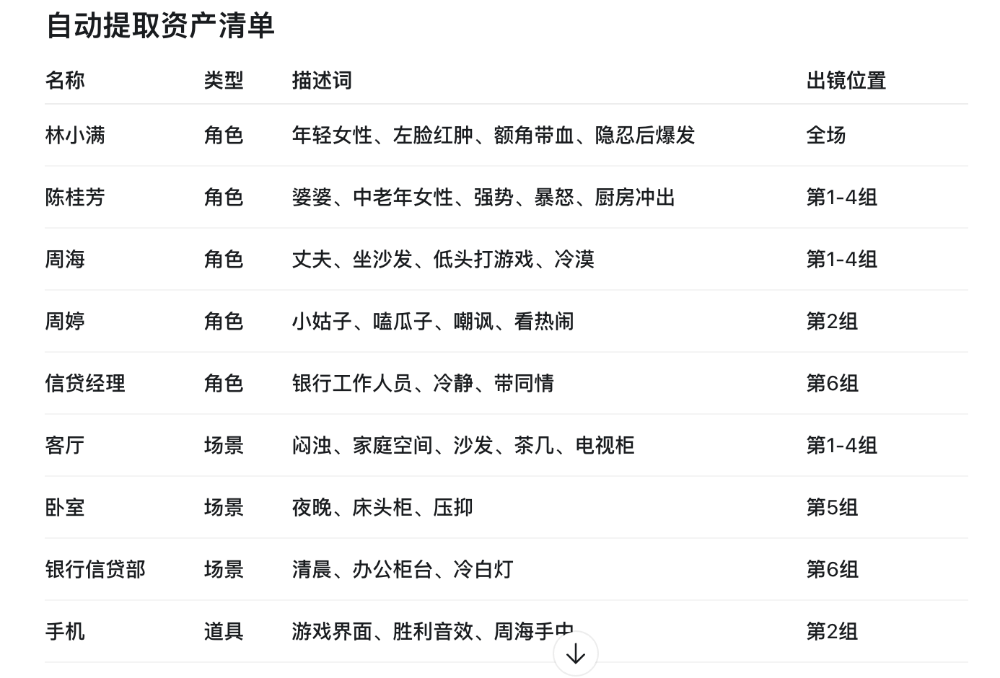
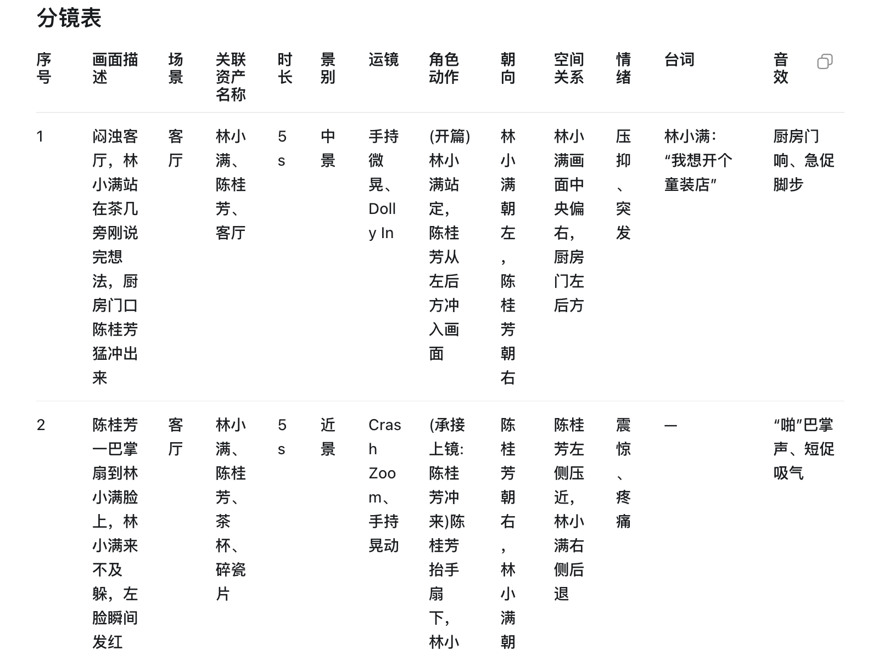
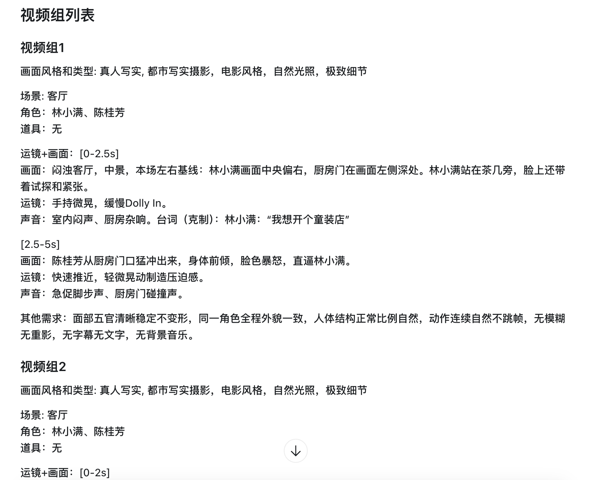

# video-agent-skills

这个仓库提供一组可复用的短剧创作技能

帮助你把小说、剧本或剧情片段快速转换成更接近生产环节的短剧资产：改编剧本、资产清单、分镜表

以及可直接粘贴到即梦、小云雀等 AI 视频平台的视频组提示词。

## 这个项目解决什么

AI 视频生成通常不缺一句提示词，缺的是稳定的前期拆解：

- 小说要先变成可拍的短剧剧本。
- 剧本要拆成镜头、场景、角色、道具和台词。
- 视频生成平台需要 4-15 秒一组、连续、具体、可复制的运镜提示词。
- 角色外貌、空间关系、伤痕、道具和情绪需要跨镜头保持一致。

`video-agent-skills` 把这些规则沉淀成智能体可调用的技能。你只需要提供原文或剧本，智能体会按规范输出下一步制作需要的结构化内容。

## 技能

| 技能 | 用途 | 主要输出 |
|---|---|---|
| `novel-to-shortdrama-script` | 将中文小说原文改编成短剧剧本 | 改编总纲、分集大纲、集末钩子、场景、台词 |
| `storyboard-lite` | 将剧本或指定集数拆成 AI 视频生产用分镜 | 自动资产清单、分镜表、视频组提示词 |

`storyboard-lite` 现在会在保留分镜表的基础上，额外输出 `## 视频组列表`。每个视频组按 4-15 秒组织，格式适合直接复制到 AI 视频生成平台：

```md
### 视频组1
画面风格和类型: 真人写实, 都市写实摄影，电影风格，自然光照，极致细节

场景: 客厅
角色：林小满、陈桂芳
道具：无

运镜+画面：[0-2.5s]
画面：...
运镜：...
声音：...

[2.5-5s]
画面：...
运镜：...
声音：... 台词（情绪）：角色："..."

其他需求：面部五官清晰稳定不变形，同一角色全程外貌一致，人体结构正常比例自然，动作连续自然不跳帧，无模糊无重影，无字幕无文字，无背景音乐。
```

## 典型流程

1. 用 `novel-to-shortdrama-script` 把小说片段改编成短剧剧本。
2. 用 `storyboard-lite` 把完整剧本或指定集数拆成分镜表。
3. 复用自动提取的角色、场景、道具名称，作为后续视频工具里的稳定资产名。
4. 复制 `视频组列表` 中的提示词到即梦、小云雀等平台生成视频。
5. 根据生成结果回到分镜或视频组提示词中微调节奏、表演、镜头和连续性。

## 示例

完整示例：

- [storyboard-lite-family-entrepreneurship.md](example/storyboard-lite-family-entrepreneurship.md)

这个示例展示了 `storyboard-lite` 如何把一段现代都市家庭冲突创业短剧，生成：

- 自动提取资产清单
- 分镜表
- 可直接粘贴到 AI 视频平台的视频组提示词

示例截图：







## 快速开始

安装后，在支持技能的智能体中直接调用：

```text
使用 $storyboard-lite，根据下面这段剧本生成分镜表和可直接粘贴到视频平台的视频组提示词：
女主推开办公室门，看见桌上的合同。老板说：“你终于来了。”
```

如果你从小说开始：

```text
使用 $novel-to-shortdrama-script，把下面这段小说改编成 3 集短剧剧本，每集 1 分钟：
女主被继母逼着替妹妹嫁给传闻中毁容的总裁。婚礼当天，她发现总裁竟是三年前救过她的人。
```

然后把生成的剧本继续交给 `storyboard-lite`：

```text
使用 $storyboard-lite，根据下面这段剧本生成分镜表和可直接粘贴到视频平台的视频组提示词：
...
```

## 安装

在本仓库目录下运行：

```bash
./install.sh
```

安装脚本会为 `skills/` 下的每个 skill 创建软链接。后续你在本仓库中修改 skill，各个智能体运行环境会通过软链接使用最新版本。默认安装位置：

- Codex: `~/.codex/skills/<skill-name>`
- Claude Code: `~/.claude/skills/<skill-name>`
- OpenClaw: `~/.openclaw/skills/<skill-name>`
- 共享智能体目录: `~/.agents/skills/<skill-name>`

也可以手动创建软链接：

```bash
ln -s /path/to/video-agent-skills/skills/novel-to-shortdrama-script ~/.codex/skills/novel-to-shortdrama-script
ln -s /path/to/video-agent-skills/skills/storyboard-lite ~/.codex/skills/storyboard-lite
```

如果你之前安装过旧路径，重新运行 `./install.sh` 可以刷新软链接。某些智能体会在会话开始时读取 skill 列表，安装或更新后建议开启新会话确认生效。

## 使用方式

Codex：

```text
使用 $novel-to-shortdrama-script，把这篇小说改编成 12 集短剧剧本，每集 2 分钟：
...

使用 $storyboard-lite，根据下面这段剧本生成分镜表和可直接粘贴到视频平台的视频组提示词：
...
```

Claude Code：

```text
/novel-to-shortdrama-script
把这篇小说改编成 12 集短剧剧本，每集 2 分钟：
...

/storyboard-lite
根据下面这段剧本生成分镜表和可直接粘贴到视频平台的视频组提示词：
...
```

OpenClaw：

```text
使用 novel-to-shortdrama-script，把这篇小说改编成 12 集短剧剧本，每集 2 分钟：
...

使用 storyboard-lite，根据下面这段剧本生成分镜表和可直接粘贴到视频平台的视频组提示词：
...
```

## 预期输出

`novel-to-shortdrama-script` 会输出：

- 改编策略和核心卖点
- 分集大纲和集末钩子
- 可拍摄的短剧场景
- 角色台词和关键动作

`storyboard-lite` 会输出：

- `自动提取资产清单`：角色、场景、道具，不生成资产 ID。
- `分镜表`：画面描述、场景、关联资产、时长、景别、运镜、角色动作、朝向、空间关系、情绪、台词、音效。
- `视频组列表`：4-15 秒一组的 AI 视频提示词，包含画面风格、场景、角色、道具、分段时间码、画面、运镜、声音和生成约束。

## 仓库结构

```text
video-agent-skills/
  example/
    storyboard-lite-family-entrepreneurship.md
    img/
      asset.png
      story_board.png
      video_prompt.png
  skills/
    novel-to-shortdrama-script/
      SKILL.md
      agents/
        openai.yaml
    storyboard-lite/
      SKILL.md
      agents/
        openai.yaml
  install.sh
  README.md
```

## 验证

安装后可以用下面的最小样例确认 `storyboard-lite` 是否生效：

```text
使用 $storyboard-lite，根据下面这段剧本生成分镜表和可直接粘贴到视频平台的视频组提示词：
女主推开办公室门，看见桌上的合同。老板说：“你终于来了。”
```

你应该看到：

- 智能体说明默认故事类型和美术风格。
- 输出包含 `## 自动提取资产清单`。
- 输出包含 `## 分镜表`。
- 输出包含 `## 视频组列表`。
- 视频组里每组都有 `画面风格和类型`、`场景`、`角色`、`道具`、时间码、`画面`、`运镜`、`声音` 和 `其他需求`。

## 卸载

删除安装脚本创建的软链接即可：

```bash
rm ~/.codex/skills/novel-to-shortdrama-script
rm ~/.codex/skills/storyboard-lite
rm ~/.claude/skills/novel-to-shortdrama-script
rm ~/.claude/skills/storyboard-lite
rm ~/.openclaw/skills/novel-to-shortdrama-script
rm ~/.openclaw/skills/storyboard-lite
rm ~/.agents/skills/novel-to-shortdrama-script
rm ~/.agents/skills/storyboard-lite
```

## 说明

这些 skill 是独立的，不依赖任何特定项目、应用、仓库、API 或外部资产数据库。
